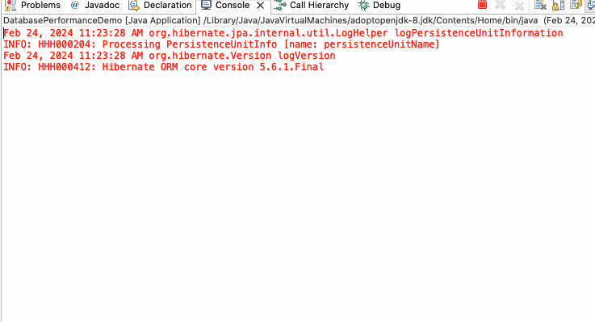

# Database Performance Comparison: Raw JDBC vs. Hibernate/JPA
**quick look**:




This project aims to compare the performance of raw JDBC and Hibernate/JPA for database access in Java applications. By measuring the execution times of equivalent operations using both approaches, developers can make informed decisions about which method to use based on their project requirements and performance considerations.

## Project Details

### Implementation Overview

The project consists of a Java application that performs database operations using two different approaches: raw JDBC and Hibernate/JPA. The code is structured as follows:

- **`DatabasePerformanceDemo.java`**: This is the main class where the performance comparison is conducted. It contains methods to test database operations using raw JDBC and Hibernate/JPA.

- **`City.java`**: This class represents the entity mapping to the 'City' table in the database. It is used in conjunction with Hibernate/JPA to perform object-relational mapping (ORM), allowing seamless interaction with the 'City' table in the database. The class typically contains fields representing the columns of the 'City' table, along with corresponding getter and setter methods to access and manipulate the data. By mapping database entities to Java objects, Hibernate/JPA simplifies data access and management tasks, providing a higher level of abstraction compared to raw JDBC."

**`Database Information`**: The database used for this demo is a MySQL sample database named "world". It contains tables related to countries, cities, and other geographic data, making it suitable for testing database access performance with Java applications.

### Raw JDBC Implementation

The raw JDBC implementation involves direct interaction with the database using JDBC APIs. Here's an overview of the raw JDBC implementation:

- **`testRawJDBC()` Method**: This method establishes a connection to the MySQL database using the JDBC URL, username, and password. It then creates a `PreparedStatement` to execute a simple SQL query (`SELECT * FROM city`) and processes the result set using a `ResultSet`. The execution time of this method is measured to evaluate the performance of raw JDBC.

### Hibernate/JPA Implementation

The Hibernate/JPA implementation leverages the Hibernate framework to interact with the database using object-relational mapping (ORM). Here's an overview of the Hibernate/JPA implementation:

- **`testHibernateJPA()` Method**: This method utilizes Hibernate's EntityManager to perform database operations. It creates an EntityManagerFactory and EntityManager using the Persistence API, executes a JPQL query (`SELECT c FROM City c`), and retrieves the results as a list of `City` entities. The execution time of this method is measured to evaluate the performance of Hibernate/JPA.

## Conclusion

Based on the performance measurements conducted in this project, the following conclusions can be drawn:

- **Raw JDBC**:
  - Raw JDBC average execution time: 268,189,278 nanoseconds.
  - Offers direct and low-level access to the database.
  - Requires manual management of database connections, queries, and result sets.
  - Suitable for scenarios where fine-grained control over database interactions is required or when performance optimization is critical.

- **Hibernate/JPA**:
  - Hibernate/JPA average execution time: 872,493,431 nanoseconds
  - Provides a higher-level abstraction over database operations.
  - Automates object-relational mapping (ORM) and simplifies database interactions through annotations or configuration.
  - Features caching mechanisms and query optimization strategies, improving performance for repetitive tasks.

## Conclusion

After conducting a performance comparison between raw JDBC and Hibernate/JPA for database access in Java applications, the following results were obtained:
The performance difference between raw JDBC and Hibernate/JPA was calculated as follows:
- Performance difference (Raw JDBC - Hibernate/JPA): -604,304,153 nanoseconds

The negative value indicates that, on average, Hibernate/JPA performed slower than raw JDBC for the tested database operations. This difference may be attributed to various factors, including ORM mapping overhead, caching mechanisms, and query optimization strategies employed by Hibernate/JPA.

Based on these results, developers should carefully consider their project requirements and performance considerations when choosing between raw JDBC and Hibernate/JPA for database access in Java applications.

## Common Scenarios

- **Hibernate Considered a Good Choice**:
  - When developing applications with a large number of repetitive database queries, Hibernate's caching mechanism can significantly improve performance by reducing the number of database round-trips. For example, in an e-commerce application, caching frequently accessed product information can speed up page loading times for users.

- **Raw JDBC Preferred for Complex Queries**:
  - In scenarios where database queries are highly complex or require advanced customization that goes beyond Hibernate's capabilities, raw JDBC is the preferred choice. For instance, when implementing complex reporting functionalities or executing stored procedures with intricate logic, raw JDBC provides more control and flexibility for crafting optimized queries.

## Clone and Run the Project

To clone and run this project in your local environment, follow these steps:

1. Clone the repository to your local machine using the following command:
   ```
   git clone https://github.com/your-username/database-performance-demo.git
   ```

2. Navigate to the project directory:
   ```
   cd database-performance-demo
   ```

3. Open the project in your preferred Java IDE (e.g., IntelliJ IDEA, Eclipse).

4. Read Setup instructions below and Run the `DatabasePerformanceDemo.java` file to execute the performance comparison between raw JDBC and Hibernate/JPA.
## Setup Instructions

Before running the code, make sure to update the JDBC connection parameters in `DatabasePerformanceDemo.java` and Hibernate/JPA connection parameters in `persistence.xml` with your MySQL database configuration:

```java
// JDBC connection parameters
// Modify the values below to match your MySQL database configuration
private static final String JDBC_URL = "jdbc:mysql://localhost:3306/<your-db-name>";
private static final String JDBC_USER = "<mysql-username>";
private static final String JDBC_PASSWORD = "<mysql-passwordname>";
```
```xml
<!-- Hibernate/JPA connection parameters -->
<!-- Modify the values below to match your MySQL database configuration -->
<persistence-unit name="myPersistenceUnit" transaction-type="RESOURCE_LOCAL">
    <properties>
        <property name="javax.persistence.jdbc.url" value="jdbc:mysql://localhost:3306/<your-db-name>"/>
        <property name="javax.persistence.jdbc.user" value="<mysql-username>"/>
        <property name="javax.persistence.jdbc.password" value="<mysql-passwordname>"/>
        <property name="javax.persistence.jdbc.driver" value="com.mysql.jdbc.Driver"/>
    </properties>
</persistence-unit>
```

